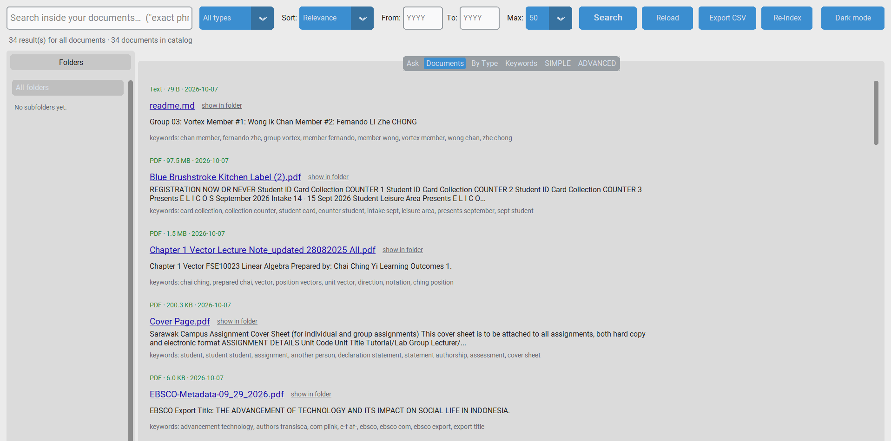
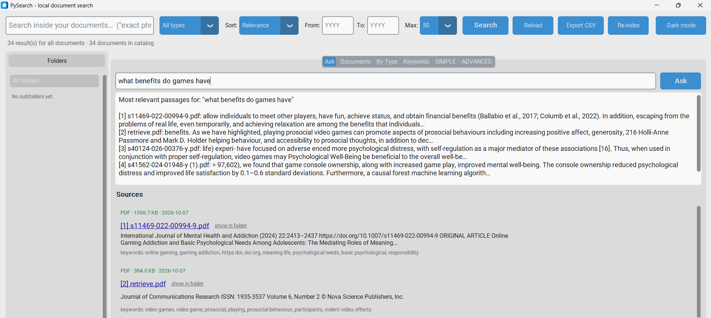
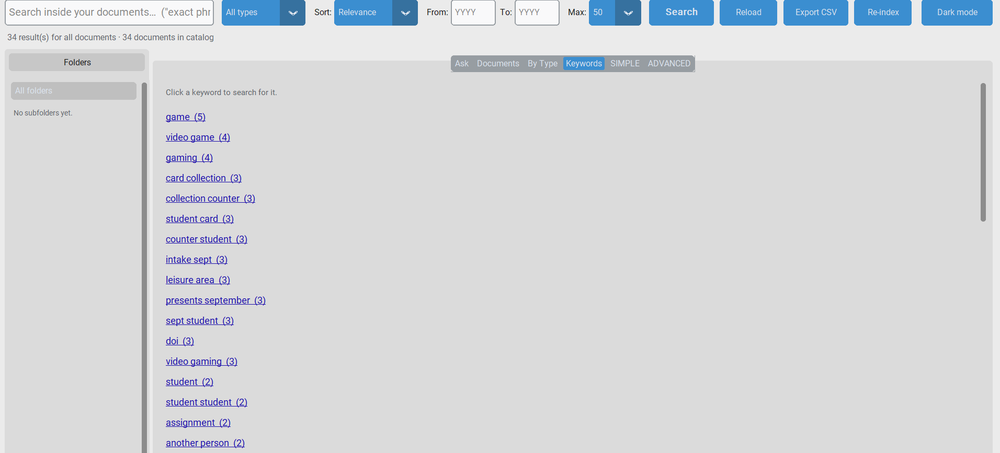

Group 03: Vortex
Member #1: Wong Ik Chan
Member #2: Fernando Li Zhe CHONG

This program tries to help with the problem of overflow in information by creating a library of imported data into a "search engine" lookalike. This local search engine has a lot of positives compared to conventional store in folder as it not just records the name of the files but also finds keywords and themes within the text using ai as well as an "ask me" section to find relevent files using questions powered by Grok. 

Setup:
To setup the program you must have the files placed in the "information" folder
Once done, run ingest.py until done.
Afterwards, setup is done, run index.py to see the GUI:

Features
There's a ask section to ask questions to grok, in which it will search through data.csv to find relevant resources
A default search section to search and find avaliable resources
By type and Keyword section that allows you to find resources by its type and search keywords respectively

Dependencies needed:

## Optional AI
Put `GROQ_API_KEY=...` or `GOOGLE_API_KEY=...` in a `.env` file. Model names change over time - override them with `GROQ_MODEL` / `GEMINI_MODEL` in `.env`.
**Privacy:** with a key set, the first ~6000 characters of each document (at ingest) and the matching passages (when you use Ask) are sent to that provider. Run `python ingest.py --no-ai` to keep everything local.
